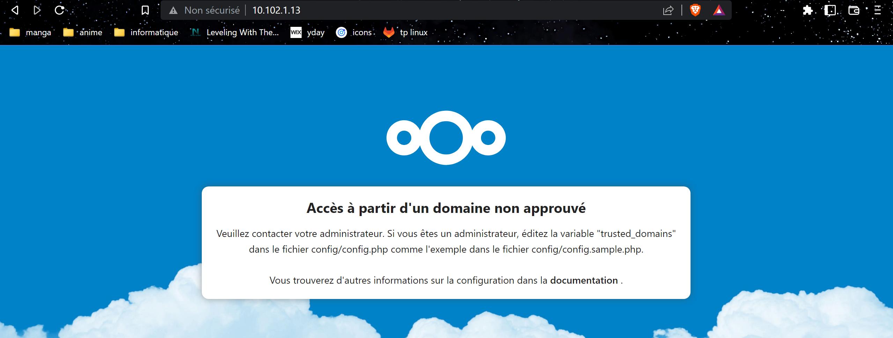

# TP3 : Amélioration de la solution NextCloud

Ce TP se présente sous forme modulaire : il est en plusieurs parties.  
Vous êtes libres d'attaquer les parties qui vous attirent le plus, et il n'est pas attendu de la part de tout le monde de poncer l'intégralité du contenu.

## Stack Web

# Module 1 : Reverse Proxy

Un reverse proxy est donc une machine que l'on place devant un autre service afin d'accueillir les clients et servir d'intermédiaire entre le client et le service.

# I. Intro

# II. Setup

🖥️ **VM `proxy.tp3.linux`**

➜ **On utilisera NGINX comme reverse proxy**

- installer le paquet `nginx`
```bash
Installed:
  nginx-1:1.20.1-10.el9.x86_64     nginx-filesystem-1:1.20.1-10.el9.noarch     rocky-logos-httpd-90.11-1.el9.noarch

Complete!
```
- démarrer le service `nginx`
```bash
[mehdi@proxy ~]$ sudo systemctl start nginx
[mehdi@proxy ~]$ sudo systemctl status nginx
● nginx.service - The nginx HTTP and reverse proxy server
     Loaded: loaded (/usr/lib/systemd/system/nginx.service; disabled; vendor preset: disabled)
     Active: active (running) since Thu 2022-11-17 16:11:48 CET; 4s ago
    Process: 32882 ExecStartPre=/usr/bin/rm -f /run/nginx.pid (code=exited, status=0/SUCCESS)
    Process: 32883 ExecStartPre=/usr/sbin/nginx -t (code=exited, status=0/SUCCESS)
    Process: 32884 ExecStart=/usr/sbin/nginx (code=exited, status=0/SUCCESS)
   Main PID: 32885 (nginx)
      Tasks: 2 (limit: 5907)
     Memory: 1.9M
        CPU: 12ms
     CGroup: /system.slice/nginx.service
             ├─32885 "nginx: master process /usr/sbin/nginx"
             └─32886 "nginx: worker process"

Nov 17 16:11:35 proxy.tp3.linux systemd[1]: Starting The nginx HTTP and reverse proxy server...
Nov 17 16:11:35 proxy.tp3.linux nginx[32883]: nginx: the configuration file /etc/nginx/nginx.conf syntax is ok
Nov 17 16:11:35 proxy.tp3.linux nginx[32883]: nginx: configuration file /etc/nginx/nginx.conf test is successful
Nov 17 16:11:35 proxy.tp3.linux systemd[1]: Started The nginx HTTP and reverse proxy server.
```
- utiliser la commande `ss` pour repérer le port sur lequel NGINX écoute
```
[mehdi@proxy ~]$ sudo ss -laputrn | grep nginx
tcp   LISTEN 0      511                   0.0.0.0:80        0.0.0.0:*    users:(("nginx",pid=32886,fd=6),("nginx",pid=32885,fd=6))
tcp   LISTEN 0      511                      [::]:80           [::]:*    users:(("nginx",pid=32886,fd=7),("nginx",pid=32885,fd=7))
```
- ouvrir un port dans le firewall pour autoriser le trafic vers NGINX
```
[mehdi@proxy ~]$ sudo firewall-cmd --add-port=80/tcp --permanent
success
```
- utiliser une commande `ps -ef` pour déterminer sous quel utilisateur tourne NGINX
```
[mehdi@proxy ~]$ ps -ef | grep nginx
root       32885       1  0 16:11 ?        00:00:00 nginx: master process /usr/sbin/nginx
nginx      32886   32885  0 16:11 ?        00:00:00 nginx: worker process
```
- vérifier que le page d'accueil NGINX est disponible en faisant une requête HTTP sur le port 80 de la machine

➜ **Configurer NGINX**

- nous ce qu'on veut, c'pas une page d'accueil moche, c'est que NGINX agisse comme un reverse proxy entre les clients et notre serveur Web
- deux choses à faire :
  - créer un fichier de configuration NGINX
    - la conf est dans `/etc/nginx`
```
    [mehdi@proxy nginx]$ sudo cat conf.d/proxy.conf
server {
# On indique le nom que client va saisir pour accéder au service
    # Pas d'erreur ici, c'est bien le nom de web, et pas de proxy qu'on veut ici !
    server_name web.tp2.linux;

    # Port d'écoute de NGINX
    listen 80;

    location / {
        # On définit des headers HTTP pour que le proxying se passe bien
        proxy_set_header  Host $host;
        proxy_set_header  X-Real-IP $remote_addr;
        proxy_set_header  X-Forwarded-Proto https;
        proxy_set_header  X-Forwarded-Host $remote_addr;
        proxy_set_header  X-Forwarded-For $proxy_add_x_forwarded_for;

        # On définit la cible du proxying
        proxy_pass http://10.102.1.11:80;
    }

    # Deux sections location recommandés par la doc NextCloud
    location /.well-known/carddav {
      return 301 $scheme://$host/remote.php/dav;
    }

    location /.well-known/caldav {
      return 301 $scheme://$host/remote.php/dav;
    }
}
```
  - NextCloud est un peu exigeant, et il demande à être informé si on le met derrière un reverse proxy
    - y'a donc un fichier de conf NextCloud à modifier
    - c'est un fichier appelé `config.php`

➜ **Modifier votre fichier `hosts` de VOTRE PC**

- pour que le service soit joignable avec le nom `web.tp2.linux`
- c'est à dire que `web.tp2.linux` doit pointer vers l'IP de `proxy.tp3.linux`
```
# Copyright (c) 1993-2009 Microsoft Corp.
#
# This is a sample HOSTS file used by Microsoft TCP/IP for Windows.
#
# This file contains the mappings of IP addresses to host names. Each
# entry should be kept on an individual line. The IP address should
# be placed in the first column followed by the corresponding host name.
# The IP address and the host name should be separated by at least one
# space.
#
# Additionally, comments (such as these) may be inserted on individual
# lines or following the machine name denoted by a '#' symbol.
#
# For example:
#
#      102.54.94.97     rhino.acme.com          # source server
#       38.25.63.10     x.acme.com              # x client host

# localhost name resolution is handled within DNS itself.
#	127.0.0.1       localhost
#	::1             localhost
10.102.1.13	web.tp2.linux
```
- autrement dit, pour votre PC :
  - `web.tp2.linux` pointe vers l'IP du reverse proxy
  - `proxy.tp3.linux` ne pointe vers rien
  - taper `http://web.tp2.linux` permet d'accéder au site (en passant de façon transparente par l'IP du proxy)

✨ **Bonus** : rendre le serveur `web.tp2.linux` injoignable sauf depuis l'IP du reverse proxy. En effet, les clients ne doivent pas joindre en direct le serveur web : notre reverse proxy est là pour servir de serveur frontal. Une fois que c'est en place :



# III. HTTPS

Le but de cette section est de permettre une connexion chiffrée lorsqu'un client se connecte. Avoir le ptit HTTPS :)

Le principe :

- on génère une paire de clés sur le serveur `proxy.tp3.linux`
```
openssl req -new -newkey rsa:2048 -days 365 -nodes -x509 -keyout server.key -out server.crt
```
On change le nom des clés :
```
sudo mv server.crt web.tp2.linux.crt
sudo mv server.key web.tp2.linux.key
```
- on ajuste la conf NGINX
  - on lui indique le chemin vers le certificat et la clé privée afin qu'il puisse les utiliser pour chiffrer le trafic
  - on lui demande d'écouter sur le port convetionnel pour HTTPS : 443 en TCP
```
listen 443 ssl;
    ssl_certificate     /etc/pki/tls/certs/web.tp2.linux.crt;
    ssl_certificate_key /etc/pki/tls/private/web.tp2.linux.key;
```

On redirige les connexions en https directement :
```
server {

    listen 80 default_server;


    server_name _;


    return 301 https://$host$request_uri;
}
```

On change le fichier de config de nextcloud :

```
'overwrite.cli.url' => 'https://web.tp2.linux',
  'overwritehost' => 'web.tp2.linux',
  'overwriteprotocol' => 'https',
```

Et au final on arrive sur notre site en tapant : "https://web.tp2.linux"


